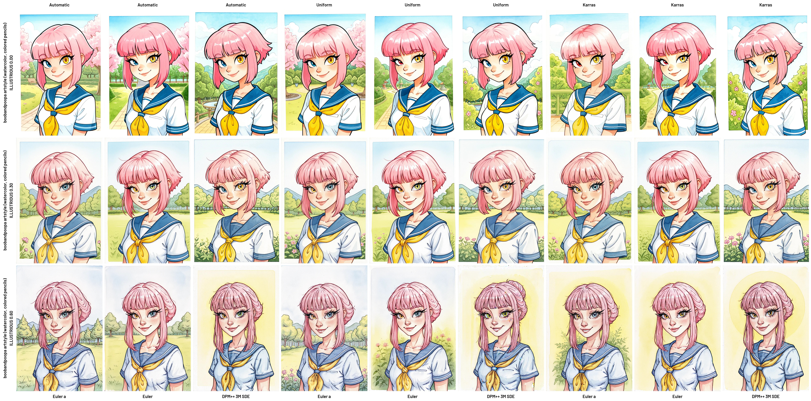

# 🧪 LoRA x Sampler x Scheduler Grid (Forge)

> 💡 An advanced script for Stable Diffusion Forge that generates comprehensive comparison grids exploring LoRA models across different samplers, schedulers, and weight combinations.

## 📝 Description

This script creates detailed image grids in two operational modes: **XY Grid** for systematic combinatorial testing and **Batch Grid** for custom sampler-scheduler pair configurations. It's designed to help artists and researchers visualize the impact of different LoRA weights across various generation parameters.

## ✨ Features

- **🎯 Dual Operation Modes**: XY Grid for automatic matrix generation and Batch Grid for customized pair combinations
- **🔄 LoRA Weight Testing**: Flexible weight range configuration with min/max values and step precision
- **🏷️ Smart Label Positioning**: Configurable label placement (Top, Bottom, Left, Right) with automatic collision detection
- **⚡ Trigger Word Support**: Optional trigger word integration with display toggle
- **🛡️ Error Resilience**: Fallback image generation with detailed error information when generation fails
- **📊 Progress Monitoring**: Real-time generation progress logging with detailed parameter information
- **🖼️ Flexible Output**: Individual cell saving and multiple format support (WEBP/PNG)
- **🎨 Custom Font Support**: Barlow-SemiBold.ttf integration for improved label readability
- **📏 Auto-Scaling**: Automatic downscaling of large grids beyond 16380px dimensions
- **🛑 Process Control**: Dedicated stop generation button for long-running operations

## ⚙️ Installation

1. Clone the repository into your Forge `/extensions/` folder:
   git clone https://github.com/PupaBoo/Forge-Grid-Sampler-Scheduler

2. Navigate to the project directory:
   cd Forge-Grid-Sampler-Scheduler

3. Install dependencies:
   pip install -r requirements.txt

4. (Optional) Place the `Barlow-SemiBold.ttf` font in the `fonts/` folder for improved label display.

5. Restart WebUI: The script will appear in the txt2img scripts dropdown as "🧪 LoRa x Sampler x Scheduler Grid (Forge)"

## 🚀 Usage

1. Launch Forge WebUI and select `🧪 LoRa x Sampler x Scheduler Grid (Forge)` from the `txt2img` script dropdown.

2. Choose a mode:
   - **XY Grid**: Select one or multiple samplers and schedulers via dropdowns. The script automatically generates all possible combinations in a comprehensive matrix format.
   - **Batch Grid**: Add custom sampler-scheduler pairs using dropdowns with the "Add Pair" button or manually enter pairs in the text field (format: `Sampler Name, Scheduler Name` per line).

3. Configure parameters:
   - **LoRA Model**: Select from available LoRA models in your models/Lora directory
   - **LoRA Weights**: Set minimum, maximum, and step values for weight testing range
   - **Trigger Word**: Optional activation word with display toggle option
   - Positive/negative prompts
   - Seed (leave blank for random)
   - Steps, CFG scale, image dimensions, padding
   - Save format (WEBP/PNG)
   - Label positions for LoRA, sampler, and scheduler (Top/Bottom/Left/Right)
   - Label visibility options
   - Individual cell saving option (saves to `outputs/cells/`)

4. Click "Generate" to create the grid. Generation progress for each combination and any errors are logged in the terminal. Use the "🛑 Stop Generation" button to interrupt long-running operations.

## 📁 Output Structure

```bash
outputs/
└── 🧪 LoRa x Sampler x Scheduler Grid (Forge)/
    ├── cells/                                  # Individual cell images
    │   ├── LoRAName_W0.50_Sampler_Scheduler_0_0.webp
    │   └── ...
    ├── xy_grid_1700000000_001.webp             # XY Grid output (WEBP format)
    ├── xy_grid_1700000000_001.png              # XY Grid output (PNG format)
    ├── batch_grid_1700000000_001.webp          # Batch Grid output (WEBP format)
    └── batch_grid_1700000000_001.png           # Batch Grid output (PNG format)
```

## 🛠 Requirements

- Stable Diffusion Forge
- Python 3.7+
- Libraries: `gradio`, `Pillow` (included with Forge)

## ⚡ Technical Features

- **Auto-Correction**: Intelligent name matching for samplers and schedulers.
- **Validation**: Comprehensive configuration validation with helpful error messages.
- **Unicode Support**: Proper handling of special characters and emojis in names.
- **Font Caching**: Optimized performance through font caching mechanisms.
- **Memory Management**: Efficient handling of large grids with auto-scaling.

## ⚠️ Limitations

- **Mode Restriction**: Works exclusively in txt2img mode.
- **Resource Intensive**: Large grids may require significant VRAM and processing time.
- **Font Dependency**: Optimal text rendering requires Barlow-SemiBold.ttf availability.
- **Grid Size**: Very large combinations may produce extremely large output files.

## 📜 License

MIT License © 2025 - Free to use with attribution.

## 🙌 Acknowledgments

- Built with Gradio and Pillow libraries
- Developed with AI assistance tools
- Inspired by the needs of the Stable Diffusion artist community

## 🤝 Contributing

Feedback, bug reports, and feature suggestions are welcome. Please report issues with detailed descriptions of the problem and your configuration.

## 📸 Examples

<table>
  <tr>
    <td align="center" width="50%">
      <br>
      <strong style="font-size:22px;">🧩 Batch Grid</strong>
    </td>
    <td align="center" width="50%">
      <br>
      <strong style="font-size:22px;">🔄 XY Grid</strong>
    </td>
  </tr>
  <tr>
    <td align="center" colspan="2">
      <br>
      <strong style="font-size:18px;">📊 Small Steps Grid</strong>
    </td>
  </tr>
  <tr>
    <td align="center" width="50%">
      <br>
      <strong style="font-size:18px;">⚡ With Trigger Word</strong>
    </td>
    <td align="center" width="50%">
      <br>
      <strong style="font-size:18px;">🚫 Without Trigger Word</strong>
    </td>
  </tr>
  <tr>
    <td align="center" colspan="2">
      <br>
      <strong style="font-size:18px;">🐋 Huge Grid</strong>
    </td>
  </tr>
</table>
